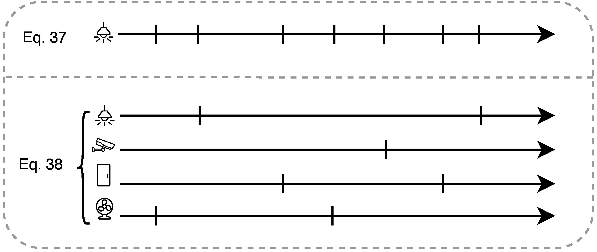
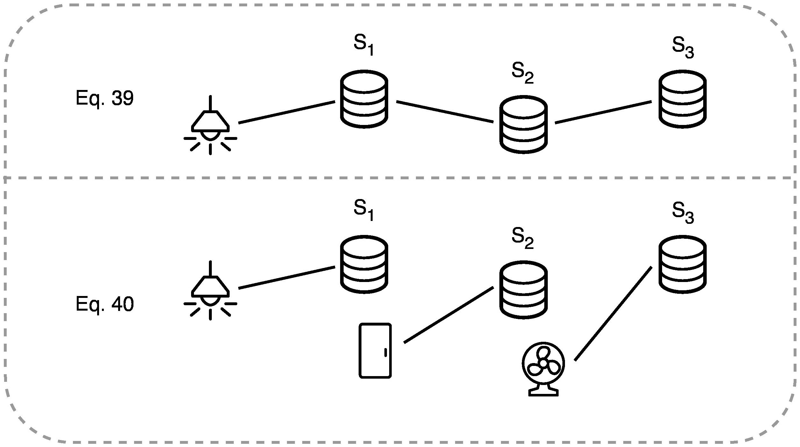
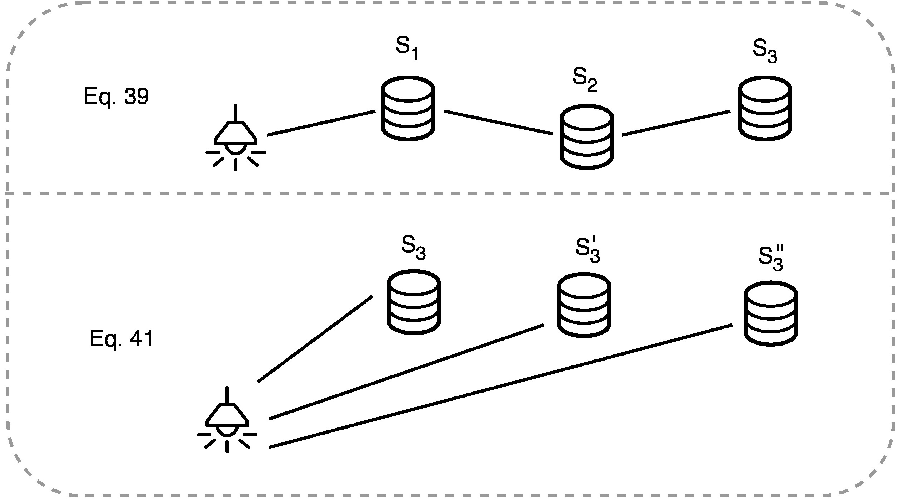
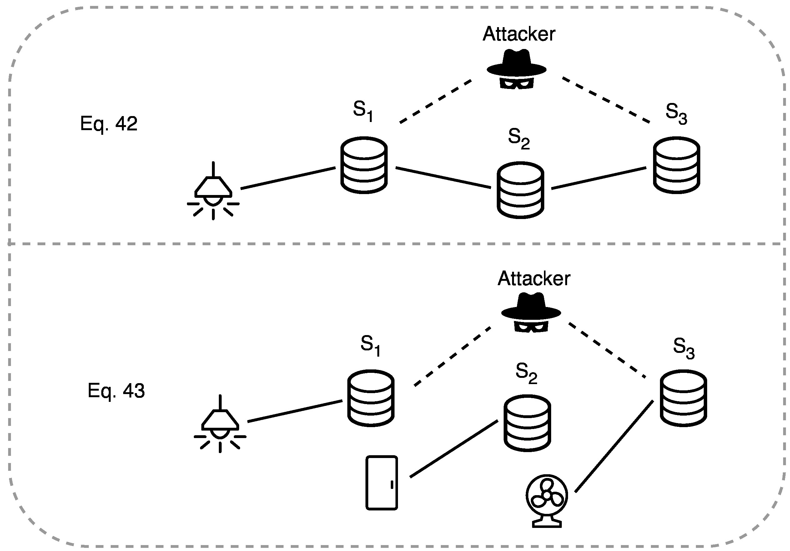

## Usage of ProVerif

Follow the instruction at the [ProVerif website](https://bblanche.gitlabpages.inria.fr/proverif/) for the installation of ProVerif version 2.05.

Then, you can check the models using the following command:
```bash
    proverif file-name.pv
```

See the [ProVerif user manual](https://bblanche.gitlabpages.inria.fr/proverif/manual.pdf) for more information.

## Unlinkability of multiple publishments

File `unlinkability-of-multiple-publishments.pv`

+ A device publishes multiple events.
+ Multiple devices publish events.



## Unlinkability within one publishment (1)

File `unlinkability-within-one-publishment-1.pv` (with no `knowledge` exposed)

+ A device follows the protocol and publishes $E_{i}^{(j)}$ using three servers.
+ Three devices partially publish events while the first device only publishes $E_{i}^{(1)}$, the second device only publishes $E_{i}'^{(2)}$, and the third device only publishes $E_{i}''^{(3)}$.



## Unlinkability within one publishment (2)

File `unlinkability-within-one-publishment-2.pv`

+ The device follows the protocol and publishes $E_{i}^{(j)}$ using three servers.
+ The device publishes only the final event $E_{i}^{(3)}$ via one server; however, it publishes three events each time, using different servers, to maintain the same number of events.



## Unlinkability within one publishment in case of colluding of some servers

File `unlinkability-within-one-publishment-with-colluding.pv` (with exposing the `knowledge` of $S_1$ and $S_3$)

+ A device follows the protocol and publishes $E_{i}^{(j)}$ using three servers. Servers $S_1$ and $S_3$ disclose all their knowledge to the attacker.
+ Three devices partially publish events while the first device only publishes $E_{i}^{(1)}$, the second device only publishes $E_{i}'^{(2)}$, and the third device only publishes $E_{i}''^{(3)}$. Servers $S_1$ and $S_3$ disclose all their knowledge to the attacker.


